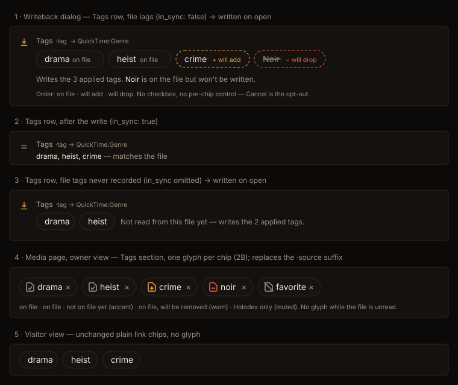

# Design handoff — Tag set writeback: dialog Tags row + on-file chip glyphs (HOLODEX-401)

**Spec:** [tag-set-writeback.md](../specs/tag-set-writeback.md) (F72) · **ADR:**
[ADR-111](../architecture/archive/ADR-111-recorded-file-tag-set.md) · **Builds on:**
[writeback-cockpit-handoff.md](writeback-cockpit-handoff.md) (HOLODEX-400: gutter glyphs, no checkboxes)
· [tag-link-chip-handoff.md](tag-link-chip-handoff.md) (HOLODEX-292: `TagLinkChip`)

## Owner decisions (2026-09-26, question cards over an inline mockup)

| Question | Answer |
|---|---|
| When the applied tags differ from the file, does the Tags row write on open? | **Yes.** The applied set is the standing decision. Cancel is the opt-out. |
| Chip marker style on the media page | **2B, a glyph on every chip.** Rejected: 2A, which marked only the exceptions. |
| How Holodex knows what is on the file | **Record at every scan** (`videos.file_tags`). Rejected: ledger-only. |
| Files scanned before this ships | **Unknown until rescan.** No glyph; the row writes on open. Rejected: a boot backfill. |

## 1. Dialog — the tag-set row (`WritebackFormDialog.svelte`)

A `genres` row with a `write_target` stops being a read-only merge row. It keeps the cockpit row
shell: the gutter glyph, then the label line (`Tags` · `·tag` · `→ {write_target}`), then the body.
The body has no chooser, because tags are curated on the page, not here.

| State (`in_sync`) | Gutter | Body |
|---|---|---|
| `false` | `↧` accent: will be written | chips in three groups, then the summary line (below) |
| `true` | `=` muted | `{values joined ", "}` in ink · `— matches the file` in muted (the existing matches line) |
| omitted (unknown) | `↧` accent | plain chips (no marker) + "Not read from this file yet — writes the {n} applied tag{s}." |
| any, but no `write_target` | `⊖` | unchanged: value + "No file tag for this container — can't be written." |

**Chips.** These are static ``s, not links or buttons, because nothing on them is actionable here.
They share the shape of `TagLinkChip`'s read-only chip: `rounded-full border px-2.5 py-1 text-sm
bg-surface-2`. The suffix is `text-[0.65rem]`, matching the dialog's `·source` suffix.

| Group | Border | Name | Suffix |
|---|---|---|---|
| on file (W ∩ F) | `border-rule` | `text-ink` | `on file`, `text-muted` |
| will add (W − F) | `border-accent border-dashed` | `text-ink` | `+ will add`, `text-accent` |
| will drop (`file_only`) | `border-warn border-dashed`, no fill | `text-muted line-through` | `− will drop`, `text-warn` |

The group order is fixed: on file, will add, will drop. Within a group, W keeps the server's item
order and the drops keep file order. Chips wrap (`flex flex-wrap gap-1.5`). Every name gets
`wrap-anywhere`, per the HOLODEX-356 overflow guard.

**Summary line** (`text-xs text-muted`, one `
`):
- W non-empty: "Writes the {n} applied tag{s}." When there are drops, it continues: "{A}, {B} {is/are}
  on the file but won't be written." The names are in `text-ink`.
- W empty and F non-empty: "Clears the file's tags." (ADR-110 D6).

**Grouping and counts.** When the row writes (`in_sync !== true`), it joins the lead "writes on open"
group and counts in `Write {n} field{s} to file` and in the header's out-of-sync count. When
`in_sync === true` it sits with the other `=` rows.

**Accessibility.** The chip list is a `<ul role="list" aria-label="Tags to write">` with one `<li>` per
chip. The suffix is real text, so a screen reader hears "crime, will add". The gutter keeps its `<title>`.

## 2. Media page — on-file glyph (`TagLinkChip.svelte`)

Owner branch only, i.e. when `onremove` is passed. The glyph comes first, then the linked name, then
the `×`. The **`·source` suffix is removed**, because provenance is noise to the owner (ADR-090, spec
Non-goals). The remove button's `file` tooltip stays, since it warns about rescans, which is a
different concern.

| `written` | `on_file` | Glyph (inline SVG, 14px, `stroke="currentColor"`) | Colour | `<title>` |
|---|---|---|---|---|
| true | true | file + check | `text-muted` | On the file |
| true | false | file + plus | `text-accent` | Not on the file yet — added on the next writeback |
| false | true | file + minus | `text-warn` | On the file — writeback is off, so the next writeback removes it |
| false | false | file + slash | `text-muted` | Kept in Holodex only — writeback is off for this tag |
| any | absent | *(no glyph)* | — | — |

The glyph is `aria-hidden` on the SVG, and the meaning is carried by a visually-hidden span, so the
chip's name reads "drama, on the file". The visitor branch is unchanged, with no glyph.

The SVG paths are inline, the same way the dialog's gutter icons are, because the repo has no icon font.
They are a 16×16 viewBox file outline plus one mark. The mockup has the exact paths.

## 3. Tokens and skins

Only existing tokens are used: `ink`, `muted`, `accent`, `warn`, `rule`, `surface-2`. There is no new
token and no hardcoded colour. QA covers Cinémathèque (`.claude/rules/frontend-theming.md`). The
accent / warn pairing on a dashed border is the risk to check.

## 4. Edge cases

- **Long tag names**: `wrap-anywhere` on the name, and the chip wraps inside the flex row.
- **Many tags** (20+): the chips wrap, with no fold. The row is one field, and the dialog body already
  scrolls.
- **Alias on the file** (`Sci-Fi` for `science fiction`): the chip is *on file* and is not a drop
  (server-side, ADR-111 D2).
- **Ancestor tags**: a parent tag that only W contains shows in the dialog, but not on the page. The
  page lists attached tags only.
- **Film dialog**: no tag-set row, unchanged.
