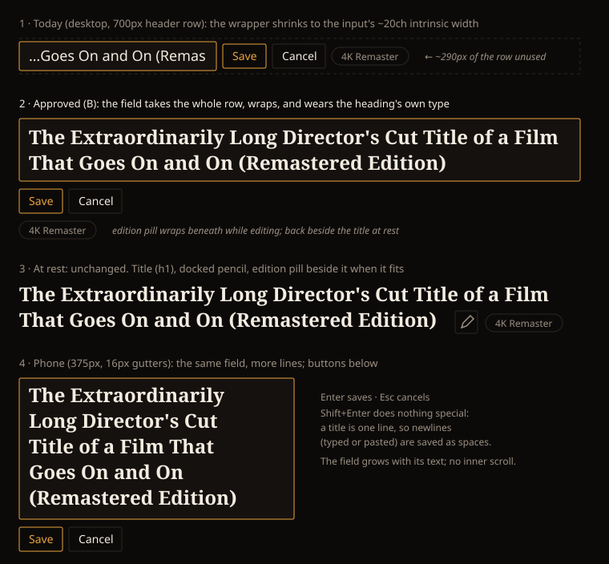

# Design Handoff: Edit a long media title in place (HOLODEX-512)

**Surfaces**: `entity/NameEditControl.svelte` (an opt-in `multiline` edit field) and
`routes/media/[id]/+page.svelte` (the title mount opts in; its wrapper takes the whole row while editing).
No new component.
**Theming contract**: [ADR-021](../architecture/archive/ADR-021-frontend-theming-and-skins.md) as amended by
[ADR-115](../architecture/archive/ADR-115-cinematheque-only-skin.md), so this is tokens only and QA'd in Cinémathèque.
**Mockup**: 
**Jira**: [HOLODEX-512](https://whoiskevinrich.atlassian.net/browse/HOLODEX-512) (bug)

---

## Problem

The title pencil on `/media/{id}` opens a single-line `<input>` that is about 20 characters wide,
whatever the screen. The page wraps the control in a shrink-to-fit flex item
(`min-w-0 max-w-full`, which is right at rest because it lets the edition pill sit beside the title).
In the edit state that item sizes to the input's intrinsic width, so the input's `flex-1` has nowhere
to grow. Measured in a 700px header row, the input was 246px wide and the title needed 802px. The
input also drops from the heading's `text-2xl skin-title` to an 18px UI-font field, so opening the
editor changes how the title looks.

## Decision (B, approved 2026-10-02)

All three parts ship together:

1. **Full row while editing.** The page's title wrapper gets `has-[form]:basis-full`. While the edit
   form is mounted, the wrapper takes the whole header row and the edition pill wraps beneath it.
   At rest nothing changes.
2. **A field that wraps.** With `multiline`, `NameEditControl` renders a `<textarea rows="1">` that
   grows with its text (no inner scroll, no resize handle). The field fills the form's width; Save
   and Cancel sit on their own line below it.
3. **Heading type.** The field wears the caller's `headingClass` (`skin-title text-2xl font-semibold
   text-ink` on the media page), so the title is edited in the type it's shown in.

Rejected during critique:

- **Today's single-line input**: shows about 30% of a long title, so the owner can't proofread the end
  of the string, which is where edition and year suffixes go.
- **A (full row only)**: one class on the page. It's better, but a 90-character title still scrolls
  inside one line, and the type still changes on open.

## Behavior

| Input | Result |
|---|---|
| Enter | Saves (same as the Save button). Never inserts a newline. |
| Shift+Enter | Same as Enter. A title is one line. |
| Esc | Cancels and returns focus to the pencil (unchanged). |
| Pasted text with newlines | Each run of whitespace containing a newline is saved as one space. |
| IME composition (Enter confirms a candidate) | Doesn't save; `isComposing` is respected. |

Open, select-all on open, trim, the "unchanged closes without a request" rule, busy, error and the
collision verdict are all unchanged.

## Scope

- **Opt-in.** `multiline` defaults to `false`. Person, Studio and Tag headings and the Film year keep
  the single-line `text-lg` input. The Film year is a four-digit value that never needs to wrap.
  Person, Studio and Tag could adopt it later with one prop and a wrapper class. That's not in this ticket.
- **Accessible name and description** stay as they are (`aria-label` = the pencil's label,
  `aria-describedby` = the error).

## Tokens

The field uses `rounded-theme border border-rule bg-surface px-3 py-1.5 focus:border-accent focus:outline-none`,
the same as the existing input, plus `headingClass` for type. The buttons are unchanged
(`btn-accent`, `btn-ghost`). There are no new tokens and no hardcoded values.

## QA (Cinémathèque)

1. `[agent]` On a media title of about 90 characters at 1280px, the field is the full header-row width and shows the whole title across two or more lines, with no horizontal scroll inside it.
2. `[agent]` At 375px, the field is no wider than the page (no page-level horizontal scroll) and grows as you type.
3. `[agent]` At rest, the title, the docked pencil and the edition pill lay out exactly as before (pill beside the title when it fits).
4. `[agent]` Enter saves; pasting `a\nb` saves `a b`; Esc cancels and focuses the pencil.
5. `[agent]` Person, Studio and Tag headings and the Film year still open the single-line input.
6. `[human]` The edit field reads as the title made editable, not as a different element.
