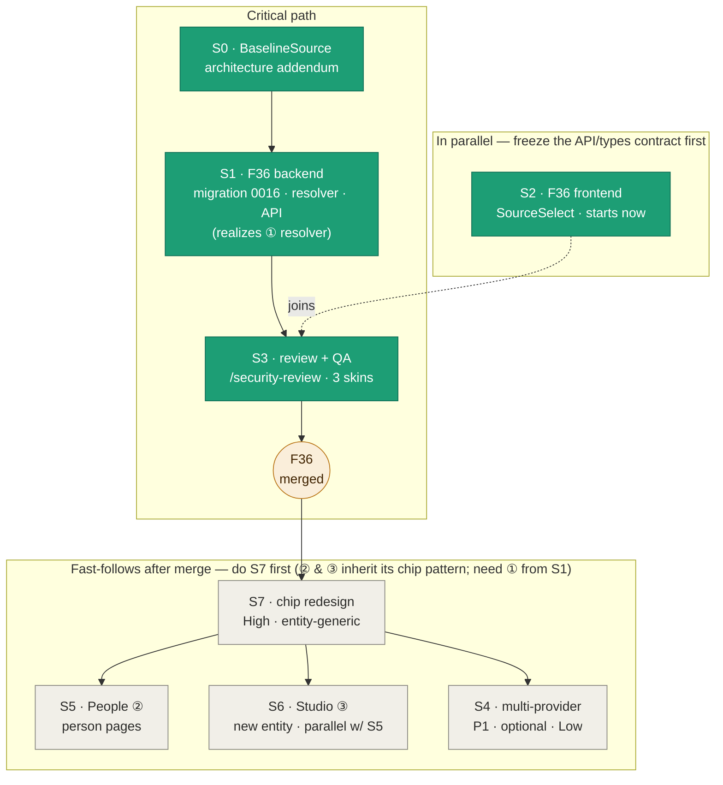

# Rollout plan: Per-field source-of-truth (F36 / ADR-051)

**Living coordination doc** — update the graph + table as sessions complete (see [Update protocol](#update-protocol)).
**Design package**: [spec F36](../specs/field-source-of-truth.md) · [ADR-051](../architecture/ADR-051-per-field-source-of-truth-decisions.md) · [handoff](../design/field-source-of-truth-handoff.md) · [QA checklist](../design/field-source-of-truth-qa-checklist.md) · [testing-strategy §9](../testing-strategy.md). Design is **complete**; this plan sequences the **implementation** across sessions.

> **Highest-leverage decision (baked in):** do **S0 BaselineSource** first and build the resolver on it
> *video-first but entity-generic* — that realizes fast-follow **① (entity-agnostic resolver)** as a
> byproduct, so People (②) and Studio (③) are unblocked the moment F36 merges, with no resolver rework.

## Session graph

**Legend** — `pending` (grey) · `active` (blue, in progress) · `done` (green, merged) · `gate` (amber, the merge milestone).
**Flow:** critical path `S0 → S1 → S3 → merge`; `S2` runs in parallel and joins at review; `S4/S5/S6` are post-merge, with `S5`/`S6` parallel to each other.

## Sessions

| ID | Scope | Depends on | Parallel with | Size | PR | Status |
|----|-------|-----------|---------------|------|----|--------|
| **S0** | `/architecture` addendum: pin the `BaselineSource` contract (video impl reads file cols + `video_metadata`); video-first but entity-generic | — | — | XS | [#69](https://github.com/whoiskevinrich/holodex/pull/69) | ☑ done (ADR-052; HOLODEX-5) |
| **S1** | F36 backend: migration 0016 `field_source_decisions`, repo CRUD, resolver decision short-circuit + file-first default + `default_source` config, `ResolvedField.decision` + sync compute, owner-gated `PUT/DELETE …/decision`, writeback writes decided value (one `WriteBatch`/file) | S0 | S2 | L | [#72](https://github.com/whoiskevinrich/holodex/pull/72) | ☑ done (HOLODEX-6) |
| **S2** | F36 frontend: `SourceSelect` radiogroup, wire into replace fields, candidates, sync indicators, "Write decisions to file" rename, 3-skin QA | frozen API/types contract (spec + handoff) | S1 | M | [#71](https://github.com/whoiskevinrich/holodex/pull/71) | ☑ done (HOLODEX-7 — integrated against merged S1, dev mock deleted, wired to the live decision API; frozen types matched S1 exactly. PR ready for review) |
| **S3** | Integration + `/security-review` (owner gate, untrusted `manual_value`) + execute the QA checklist (smoke/agent/human-3-skin) | S1 + S2 | — | M | gates the merge | ☑ done — live QA §2/§3/§4 **passed** against the `backend-films` stack (TMDB-enriched Dune 2021): PUT/DELETE decision round-trips (204, DB-only — no writeback), `·file`/`·tmdb`/`·manual` provenance, out-of-sync pill + header count, visitor-view gating, roving tabindex; all three skins render (Brutalist filled-accent + warn pill read cleanly). `/security-review` was S1's gate (#72). §3.12 one-`WriteBatch` + §3.13 server 401/403 covered by S1 tests (not re-driven — would mutate real files) |
| **S4** | Multi-provider (P1): inter-provider trust order config, one `Adopt` per matched provider, "providers differ" hint | F36 merged | S5/S6 | M | [HOLODEX-9](https://whoiskevinrich.atlassian.net/browse/HOLODEX-9) · **Low** | ☐ not started (sequence **after** S7 — the chip redesign deletes the "providers differ" hint) |
| **S5** | ② People refactor: person detail through resolver + curation + decisions | ① (from S1) | S6 | L | [HOLODEX-10](https://whoiskevinrich.atlassian.net/browse/HOLODEX-10) · **Medium** | ☐ not started (inherits S7's chip vocabulary) |
| **S6** | ③ Studio entity: table, scan resolve-or-create, FTS, page, facet → inherits decisions | ① (from S1) | S5 | L | [HOLODEX-11](https://whoiskevinrich.atlassian.net/browse/HOLODEX-11) · **Medium** | ☐ not started (inherits S7's chip vocabulary) |
| **S7** | Chip redesign: unify the source control on selectable source-chips (● radio for replace, ✕ for merge), reusing `CurationChip` + its provenance dedup; entity-generic. Deletes the resolved-chip / candidates-line / "providers differ" duplication | F36 merged | — | M | [HOLODEX-112](https://whoiskevinrich.atlassian.net/browse/HOLODEX-112) · **High** | ☐ not started — **do first of the fast-follows** (surfaced via `/design-critique`; gates the pattern S5/S6 copy) · `/design-handoff` to revise RD1 |
| **—** | Extract shared `InlineEditInput` (Enter-commit/Escape-cancel/blur-commit) used by `CurationChip`/`CurationFieldRow`/`SourceSelect` — pre-existing duplication | — | — | S | [HOLODEX-111](https://whoiskevinrich.atlassian.net/browse/HOLODEX-111) · **Low** | ☐ not started (chore; non-blocking) |

### Post-merge order (once PR #71 lands)

The critical path `S0 → S1 → S2 → S3` is **done**; F36 merges when #71 lands. The Jira **priority** field
tiers the fast-follows (High → do next); this list is the finer-grained sequence the 3-tier field can't hold:

1. **S7 · chip redesign** ([HOLODEX-112](https://whoiskevinrich.atlassian.net/browse/HOLODEX-112), **High**) — reshapes the editable-field vocabulary; do it **before** People/Studio so they inherit one pattern (entity-generic by design). `/design-handoff` first.
2. **② People** ([HOLODEX-10](https://whoiskevinrich.atlassian.net/browse/HOLODEX-10), **Medium**) — the keystone the S0/S1 resolver-generalization was built to unlock.
3. **③ Studio** ([HOLODEX-11](https://whoiskevinrich.atlassian.net/browse/HOLODEX-11), **Medium**) — parallel with ② once S7 lands.
4. **S4 multi-provider** ([HOLODEX-9](https://whoiskevinrich.atlassian.net/browse/HOLODEX-9), **Low**) — P1/optional; sequence after S7 (which removes the "providers differ" hint it would otherwise add).
5. **`InlineEditInput` extract** ([HOLODEX-111](https://whoiskevinrich.atlassian.net/browse/HOLODEX-111), **Low**) — small chore; fold into S7 (which touches all three call sites) or take standalone.

## Why this sequence (speed · tokens · progress)

- **Speed** — S2 (frontend) starts immediately, parallel to S1: the API shape and `ResolvedField.decision` / `in_sync` payload are already frozen in the spec + handoff, so `SourceSelect` builds against a typed stub. Frontend and backend touch **disjoint files** → no merge contention. Post-merge, S5 + S6 run in parallel.
- **Token utilization** — each session is one-PR-sized and uses a **doc section as its contract** instead of re-deriving: S1 → spec P0-1…5 + testing-strategy §9; S2 → handoff + QA §3/§4; S3 → the QA checklist verbatim. Use **separate worktrees** for parallel sessions (S1/S2, later S5/S6) so none reloads another's churn. `/security-review` runs **once** (S3, backend diff only).
- **Progress** — folding ① into S1 means the F36 merge instantly unblocks ② and ③; the resolver refactor is paid for once.

## The S0/S1 fork
**Pure video-first** (hardcode `*model.Video`) is marginally faster for S1 alone but forces ②/③ to reopen `resolver.Resolve`. **Fold-in-① (recommended):** S0 defines `BaselineSource` as the seam; S1 implements only the *video* `BaselineSource` — ~same cost, but the resolver comes out entity-generic and ① is done. Net faster across the whole plan.

## Launch-ready session briefs

- **S0 + S1:** "Implement F36 backend per `docs/specs/field-source-of-truth.md` (P0-1…P0-8) and `docs/architecture/ADR-051` §2–5. Start with a short ADR addendum pinning a `BaselineSource` contract (video-first but entity-generic), then: migration 0016 `field_source_decisions`, repo CRUD, resolver decision short-circuit + file-first default + `default_source` config, `ResolvedField.decision` + per-field sync, owner-gated `PUT/DELETE /media/{id}/fields/{canonical}/decision`, writeback writes the decided value. Satisfy testing-strategy §9 F36 rows — especially the **one-`WriteBatch`-per-file** assertion and decisions-are-DB-only. Honor the atomic-batched-writes constraint. New worktree."
- **S2 (parallel):** "Build the F36 frontend per `docs/design/field-source-of-truth-handoff.md`: the `SourceSelect` radiogroup on replace fields, candidates, per-field + section sync indicators, 'Write decisions to file' rename. Build against the typed payload in the spec (`ResolvedField.decision`, `in_sync`) + the decision endpoints; mock the API until S1 lands. Pass QA §3/§4, tokens-only, 3 skins. Separate worktree from the backend."
- **S3 (gate):** "Run `/security-review` on the F36 backend diff (owner gate, untrusted `manual_value` → file write) and execute `docs/design/field-source-of-truth-qa-checklist.md` §2–§4."

## Update protocol

When a session changes state, update **both** the graph and the table here:

1. **Graph** — move the node's id between the `class … done|active|pending` lines at the bottom of the Mermaid block. E.g. when S1 starts: move `S1` to the `active` class; when its PR merges: move it to `done`. Flip `M` (`F36 merged`) to `done` once S3 merges F36.
2. **Table** — set the Status cell (`☐ not started` → `◐ in progress` → `☑ done`) and drop the PR link in the PR column.
3. **Briefs** — strike a brief once its session has merged; add the actual PR URL.

Keep this file as the single source of truth for *where the rollout stands*; the spec/ADR/handoff/QA stay the source of truth for *what to build*.
