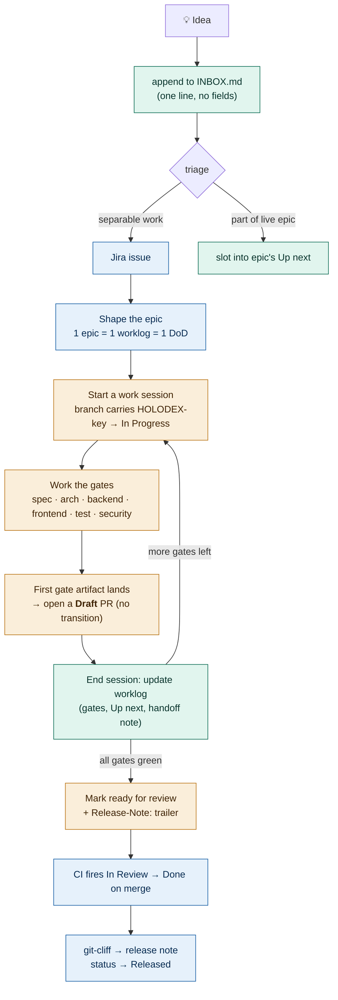

# Workflow: Idea → Merge → Release (human manual)

This is the operating manual for how work moves through Holodex — from a thought you don't want to
lose, to a scoped epic, through multi-session implementation, to a merged PR and a release note.

It exists because **sessions are disposable and the agent forgets.** So the truth about work lives in
cheap, durable, local files — never in an agent's head. Your job as the human is to keep those files
honest; the agent's job is to think, act, and update them.

> **The one rule everything derives from:** *never let durable state depend on an agent (or you)
> remembering to do something at the end.* Either it falls out of an artifact (a commit, a branch name,
> a file on disk) or a hook fires it. If a step below feels like "I must remember to…", that's a smell —
> it should be automated or checked.

## Where truth lives

| Layer | Home | Lifecycle | Authority for |
|---|---|---|---|
| **Idea capture** | `docs/backlog/INBOX.md` | seconds | "don't lose this" — unstructured, offline, always works |
| **Coarse board** | Jira `HOLODEX` | weeks–months | what exists, what's in flight, parent/child, priority |
| **Fine truth** | `docs/plans/HOLODEX-<key>.md` (worklog) | one epic | gate status, ordered next actions, cross-session handoff |
| **Merge record** | commits / PR + `Release-Note:` trailer | one change | what changed, the user-facing sentence |
| **Release notes** | git-cliff → GHCR release | one release | aggregated, user-facing history |

Jira is the loose container. The **worklog is the load-bearing artifact** — it's what lets a fresh
session pick up exactly where the last one dropped.

## The lifecycle at a glance



---

## Answering "what's left to merge to prod?"

The stages above run forward. This is the reverse view — you're holding a piece of work at some level
and need to read out what remains. First, fix the finish line:

> **"In prod" = `Released`** (shipped in a tagged GHCR image) — **not** merged. `Done` only means it's
> on `main`; there is always a release hop after merge.

Every piece of work rides the same status ladder — that's the universal spine:

```
To Do → In Progress → In Review → Done (merged to main) → Released (in prod)
```

So "what's left" is always *how far up that ladder, plus any gate or checklist work still blocking the
next hop.* Read it off by what you're holding:

| You're holding | Look at | "What's left" = |
|---|---|---|
| **Idea** | `INBOX.md`, or the issue it became | Still in `INBOX.md`? Triage it first (Stage 1) — it has no status yet. Once it's an issue/epic, read that row below. |
| **Task / Story** | the issue's status + its **parent epic's worklog** | remaining ladder hops + anything it's blocked on (worklog `depends-on` or a `⟂ blocked on #n` in Up next). A lone task rides the ladder; it inherits its epic's gates rather than carrying its own. |
| **Epic** | its worklog `docs/plans/HOLODEX-<key>.md` | unchecked gates (`[ ]` / `[/]` / `[~]`) + the ordered **Up next** queue + any child issues not yet `Done`. This is the richest answer — the worklog exists for exactly this question. |
| **PR** | PR checks + the **pre-commit checklist** (Stage 4) + Jira | still Draft? → the remaining gates (it's tracking work, not review). Then: mark ready (fires `In Review`) → review approval → CI green → merge (fires `Done`) → release (fires `Released`). If the PR closes an epic, also a `release_note` set. |

Two things to internalize:
- **Merged ≠ in prod.** Finishing a PR gets you to `Done`; a release tag is what moves it to `Released`.
- **Fine-grained "what's left" lives only in the worklog.** Jira tells you the ladder rung; the worklog
  tells you the gates and the ordered remainder *within* that rung. For anything epic-sized, that's the
  place to look — and if a piece of work has no worklog yet, that absence *is* the answer: it hasn't
  been shaped (Stage 2).

### Run it

Rather than read this off by hand, run the probe — it composes the Jira ladder position, the worklog
gates + Up next, and the open-child count into one readout:

```
node scripts/whats-left.mjs HOLODEX-18
```

Needs `JIRA_USER_EMAIL` + `JIRA_API_TOKEN` in the environment (same vars as the CI Jira scripts; token
from <https://id.atlassian.com/manage-profile/security/api-tokens>). It is **read-only** — it never
transitions anything. For an epic it prints gates, ordered Up next, blockers, and children not yet Done;
for a Task/Story it prints the remaining hops and points you at the parent epic's worklog. Parser logic
is covered by `scripts/whats-left.test.mjs`; run every script suite with `make test-scripts`
(also folded into `make test`, and run in CI by the `scripts` job).

---

## Stage 0 — Capture the idea (never lose it)

The moment a thought appears mid-flow, capture it and move on. **Do not** stop to open Jira or fill
fields — that friction is exactly why ideas get lost.

- Append one line to `docs/backlog/INBOX.md`. No ceremony:
  ```
  - idea: facet-switch should remember the last choice (noticed during HOLODEX-118)
  ```
- If Claude surfaces an idea while working, it drops it in the same file. Anything tagged `IDEA:` in a
  session gets swept there on close-out, so a forgotten one is still caught.

Capture is instant and offline. Organizing happens later, in bulk. Keep the two separate.

## Stage 1 — Triage the inbox (bulk, deliberate)

Periodically (not mid-task) drain the inbox. For each line, decide one of:

- **Separable work** → create a Jira issue (Story for `feat`, Bug for `fix`, Task for the rest). Parent
  it to the right epic via the `parent` field.
- **Part of a live epic** → add it to that epic's worklog **Up next** queue instead of a ticket.
- **Not worth doing** → delete the line.

Then clear the line from `INBOX.md`. Triage is the only place the flaky Jira connector is in the loop —
and it's fine here, because you're doing it deliberately, not mid-flow.

## Stage 2 — Shape the epic (the anti-muddle rule)

Before real work starts, make sure the epic is *one coherent body of work*, not a grab-bag. The
invariant:

> **1 epic = 1 worklog = 1 definition of done.**

An epic that is secretly two epics, or a bucket with no "done when," is a muddle — it hides what's
actually left. If you spot one:

- **Split** it at the natural seam (create new epics, re-parent the children).
- **Trim** scope that's already been delivered by other work (close those children with a comment
  pointing at what delivered them).
- Give every epic a **"Done when:"** line in its description.

This is a *reconcile-reality* pass, not a Jira beautification project — touch the board minimally, only
enough to restore the 1:1. (Worked example: on 2026-07-07 the `Enrichment foundation` grab-bag was split
into five scoped epics — `Enrichment fields`, `Writeback`, `Multi-provider UX`, `Batch`, `Identity & MCP`
— each with its own DoD.)

## Stage 3 — Start a work session

Three things happen at the start of every session. Two are (or will be) automatic:

1. **Name the branch/worktree with the issue key** — `HOLODEX-123-short-slug`. This is load-bearing:
   GitHub-for-Jira links the branch, PR, and build to the issue *only* if the key is in the name. If a
   worktree spun up with an auto-name (`claude/…`), rename it first: `git branch -m HOLODEX-123-slug`.
2. **Fire `In Progress`** — the one status transition the agent/hook owns (CI owns the rest). *Today:*
   done via the direct Jira REST call. *When flightplan ships:* a `SessionStart` hook does it from the
   branch name automatically.
3. **Orient** — read the epic's worklog and its Jira children so you know the top of the queue. *When
   flightplan ships:* the hook prints a ~150-token banner (top of Up next, gate summary `3/6`, last
   handoff sentence) so you don't hunt.

If the worklog doesn't exist yet, scaffold it from the template (Stage 4 shows its shape).

## Stage 4 — Work the gates

A large epic passes through gates — the change-routing table from `CLAUDE.md`. Each gate has a
required artifact and the skill that produces it:

| Gate | Run | Artifact |
|---|---|---|
| spec | `/write-spec` | `docs/specs/*` |
| architecture | `/architecture` | an ADR in `docs/architecture/` |
| backend | — | the implementation |
| frontend | — | the implementation (+ QA all three skins) |
| testing | `/testing-strategy` | updated `docs/testing-strategy.md` + tests |
| security | `/security-review` | sign-off (required for auth/access/infra) |

### Open the Draft PR as soon as the first gate artifact lands

The first gates are **pre-implementation** — an ADR or a spec wants review *before* the code
exists, while changing the design is still cheap. So the moment the first gate artifact lands
on the branch, push it and open a **Draft PR** ([ADR-069](../architecture/ADR-069-draft-prs-for-pre-implementation-gates.md)):

- **Draft is the normal state of in-flight work.** It's the epic's one PR, and it accumulates
  the remaining gates over the following sessions. Don't open a separate "ADR PR" to merge
  ahead of the implementation.
- **A Draft PR fires no Jira transition** — the ticket stays `In Progress`, which is the truth.
  The design is in review; the *work* isn't. `In Review` fires when you **mark it ready for
  review** (Stage 6), so that column stays a real queue instead of a bucket.
- **You still get everything a PR is for**: a reviewable diff and comment thread on the ADR,
  CI on every push, and the branch/commits/PR wired into the Jira dev panel.
- **`Done` can't fire early**, because GitHub won't merge a Draft. That's why this needs no
  label, trailer, or convention to police — the state does the enforcing.

The **worklog** tracks your position through them. Its anatomy:

```markdown
---
key: HOLODEX-123
status: In Progress
depends-on: [HOLODEX-117]      # cross-epic blockers, surfaced at orientation
release_note: "One user-facing sentence — authored once, promoted at merge."
---

## Gates — definition of done
- [x] spec          docs/specs/phase-4.md · S2
- [x] architecture  ADR-051 · S2
- [/] backend       internal/resolver · S4   (in progress)
- [ ] frontend      not started
- [~] testing       deferred until: backend merged
- [ ] security      not started

## Up next   (ordered — position is the priority; top line is the next action)
1. Wire decision-chips to resolved studio field     [frontend]
2. Facet-switch on merge                            [frontend] → HOLODEX-120
3. Regenerate testing-strategy for merge paths      [testing]  ⟂ blocked on #1

## Session log   (append-only)
S4 · /write-spec /architecture /simplify
S5 · /design-handoff
```

**Checkbox legend:** `[ ]` not started · `[/]` in progress · `[~]` deferred (always with an `until:`
clause) · `[x]` done.

Rules that keep it honest:
- **Running a skill moves a gate to `[/]`, never `[x]`.** "Done" is a judgment call you (or `/handoff`)
  make — a hook must never claim a gate is finished.
- **`Up next` is ordered and position *is* the priority.** No P1/P2 noise. The top line is the single
  next action; that's what a fresh session reads first.
- **Promote, don't hoard.** When an `Up next` item is really separable work, graduate it to a Jira issue
  and record the link with `→ KEY`. That keeps the worklog from becoming a shadow tracker.

**Pre-commit** (every commit, per `CLAUDE.md`): run `/simplify` on the changed code; run
`/security-review` if you touched auth/access/infra; confirm the matching spec/ADR/design/testing
artifact exists; scan for secrets; if you touched the frontend, QA all three skins.

## Stage 5 — End a session cleanly (the handoff)

This is where cross-session work survives. Before you stop:

- **Update the worklog** — tick gates, write/refresh the `## Up next` top line, add any `until:` on
  deferred gates. This is the handoff note the *next* session lives on.
- *When flightplan ships:* a `Stop` hook checks whether you touched code but never updated the worklog
  and **nags loudly** if so. It can't write the note for you (a Stop hook can't invoke Claude), but it
  makes a skipped handoff impossible to miss; the next `SessionStart` also flags "last session left no
  handoff."

**Session hygiene — the efficiency payoff.** Because handoff is now cheap, *end sessions at gate
boundaries* rather than running one mega-session until it degrades. The worklog is a token optimization:
re-deriving "where was I" from code and diffs costs thousands of tokens and often gets it wrong; a
20-line handoff replaces all of it. So the right unit of work is **one gate, one clean session.**

Token habits that compound (take these from the context-limits research, made non-optional here):
- Prefer **specific prompts with exact file paths** over vague ones that trigger expensive exploration.
- **Delegate research to a subagent** — it reads the codebase in a disposable context and returns a
  compressed summary, keeping your main session's context clean.
- Use `/compact` to stay alive *within* a session; rely on the worklog *across* sessions.
- Excerpt error logs — don't paste the whole thing.

## Stage 6 — Merge

- **Mark the Draft PR ready for review** once the worklog's gates are green. This — not opening
  the PR — is what fires `In Review`. Keep the **subject a clean Conventional Commit**
  (release-please and git-cliff parse it) — the issue key stays in the *branch name*, never the
  subject.
- Put the user-facing sentence in a **`Release-Note:` git trailer** on the squash-merge commit (promoted
  from the worklog's `release_note:`). The trailer keeps the subject clean while git-cliff still picks up
  the note. An epic shouldn't close with all gates green but no `release_note` set.
- On ready-for-review and merge, **CI fires `In Review` then `Done`** (ADR-058/069). You don't touch
  status here — it derives from the git events.

## Stage 7 — Release

- git-cliff aggregates the `Release-Note:` trailers into the user-facing notes; the GHCR deployment
  transitions shipped issues to **Released**. Nothing manual.
- The one authored sentence now appears in three linked places without ever being copied: the worklog
  (draft), the merge trailer (curated), the release note (aggregated) — threaded by the issue key → PR #.

---

## Quick reference

**The five-minute version:** capture ideas to `INBOX.md` → triage in bulk into Jira or an epic's Up
next → make each epic `1 epic = 1 worklog = 1 DoD` → branch names carry the key → work the gates,
keeping the worklog's gates + ordered Up next honest → **Draft PR as soon as the first gate artifact
lands** → end sessions at gate boundaries with a handoff note → mark ready for review when the gates
are green, clean Conventional-Commit subject with a `Release-Note:` trailer → CI and git-cliff do the rest.

**Today vs. when the flightplan plugin ships** (design: [`../plans/flightplan-plugin.md`](../plans/flightplan-plugin.md)):

| Step | Today (manual) | After flightplan |
|---|---|---|
| `In Progress` at session start | direct REST call | `SessionStart` hook, from branch name |
| Orientation | you read the worklog + Jira | hook prints the ~150-token banner |
| Skill-run logging | — | `PostToolUse(Skill)` hook appends to session log |
| Handoff reminder | your discipline | `Stop` hook nags on stale worklog |
| Gate ticking / release-note promotion | by hand | `/handoff` skill |
| Idea capture / triage | `INBOX.md` by hand | `/triage` skill + auto-sweep |

Until the plugin exists, this manual is the manual — the worklog, the inbox, the epic-hygiene rule, and
the branch/commit discipline all work by hand today and are worth doing now.
```
