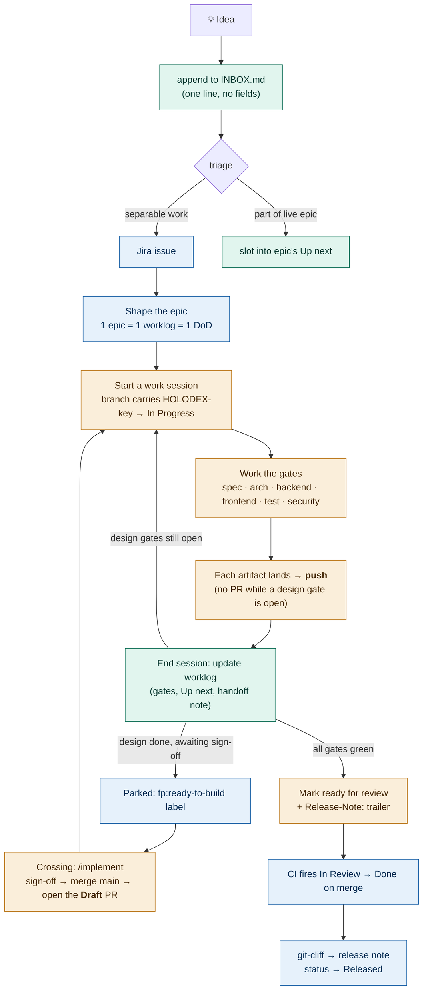

# Workflow: Idea → Merge → Release (human manual)

This is the operating manual for how work moves through Holodex — from a thought you don't want to
lose, to a scoped epic, through multi-session implementation, to a merged PR and a release note.

It exists because **sessions are disposable and the agent forgets.** So the truth about work lives in
cheap, durable, local files — never in an agent's head. Your job as the human is to keep those files
honest; the agent's job is to think, act, and update them.

> **The one rule everything derives from:** *never let durable state depend on an agent (or you)
> remembering to do something at the end.* Either it falls out of an artifact (a commit, a branch name,
> a file on disk) or a hook fires it. If a step below feels like "I must remember to…", that's a smell —
> it should be automated or checked.

## Where truth lives

| Layer | Home | Lifecycle | Authority for |
|---|---|---|---|
| **Idea capture** | `INBOX.md` in the shared git dir (`<git common dir>/flightplan/`) | seconds | "don't lose this" — unstructured, offline, always works |
| **Coarse board** | Jira `HOLODEX` | weeks–months | what exists, what's in flight, parent/child, priority |
| **Fine truth** | `docs/plans/HOLODEX-<key>.md` (worklog) | one epic | gate status, ordered next actions, cross-session handoff |
| **Merge record** | commits / PR + `Release-Note:` trailer | one change | what changed, the user-facing sentence |
| **Release notes** | git-cliff → GHCR release | one release | aggregated, user-facing history |

Jira is the loose container. The **worklog is the load-bearing artifact** — it's what lets a fresh
session pick up exactly where the last one dropped.

### Flightplan does the mechanical half

The hooks and skills that keep these files honest come from **Flightplan**, a Claude Code plugin
installed at user scope from its own repository. Nothing of it is vendored here. This repo holds
only two things:

- **`.claude/flightplan.yaml`** — the config (tracker, branch-key regex, worklog dir, gate roster,
  postures, phases). Its presence is also the opt-in: the plugin's hooks leave a repo without it
  alone.
- **`docs/plans/<KEY>.md`** — the worklogs themselves, which are Holodex data.

`scripts/lib/worklog.mjs` is a vendored copy of the worklog **reader**, used by
`scripts/whats-left.mjs` and the `worklog gate` CI check, because a clean CI checkout has no
plugin cache to import from. Keep it diffable against upstream.

The split is strict: **hooks are mechanical, judgment lives in skills.** A hook may append,
transition, scaffold, print or refuse; it never invokes Claude (a hook that re-enters Claude can
fork-bomb the session) and never marks a gate `[x]`. Only `/handoff` does that.

| What | Fired by |
|---|---|
| `In Progress` from the branch key, worklog scaffold, ~150-token orientation banner | `SessionStart` hook |
| Skill run appended to the session log, its gate moved to `[/]` | `PostToolUse(Skill)` hook |
| Nag when code changed but the worklog didn't | `Stop` hook (the next `SessionStart` repeats it) |
| `IDEA:` line captured to the inbox | `UserPromptSubmit` hook |
| Refuse `gh pr create` while a design gate is open; require a fresh handoff before `git push` | `PreToolUse` guard |
| Gate ticks, deferrals, Up next, `release_note`, `fp:ready-to-build`, marking the PR ready | `/handoff` |
| Design → build crossing | `/implement` |
| Draining the inbox | `/triage` |

The guard is wired per machine in user settings, not in this repo. On a machine without it
(or with `FLIGHTPLAN_GUARD=off`) nothing refuses anything, so **this manual states every rule
in full** rather than leaning on the hook.

## The lifecycle at a glance


```mermaid
flowchart TB
  I["💡 Idea"] --> INBOX["append to INBOX.md<br/>(one line, no fields)"]
  INBOX --> TRIAGE{"triage"}
  TRIAGE -->|separable work| ISSUE["Jira issue"]
  TRIAGE -->|part of live epic| UPNEXT["slot into epic's Up next"]
  ISSUE --> EPIC["Shape the epic<br/>1 epic = 1 worklog = 1 DoD"]
  EPIC --> SESSION["Start a work session<br/>branch carries HOLODEX-key → In Progress"]
  SESSION --> GATES["Work the gates<br/>spec · arch · backend · frontend · test · security"]
  GATES --> PUSH["Each artifact lands → <b>push</b><br/>(no PR while a design gate is open)"]
  PUSH --> HANDOFF["End session: update worklog<br/>(gates, Up next, handoff note)"]
  HANDOFF -->|design gates still open| SESSION
  HANDOFF -->|design done, awaiting sign-off| PARK["Parked: fp:ready-to-build label"]
  PARK --> IMPL["Crossing: /implement<br/>sign-off → merge main → open the <b>Draft</b> PR"]
  IMPL --> SESSION
  HANDOFF -->|all gates green| PR["Mark ready for review<br/>+ Release-Note: trailer"]
  PR --> CI["CI fires In Review → Done on merge"]
  CI --> REL["git-cliff → release note<br/>status → Released"]

  classDef file fill:#e1f5ee,stroke:#0f6e56,color:#04342c;
  classDef jira fill:#e6f1fb,stroke:#185fa5,color:#042c53;
  classDef gate fill:#faeeda,stroke:#ba7517,color:#412402;
  class INBOX,HANDOFF,UPNEXT file;
  class ISSUE,EPIC,PARK,CI,REL jira;
  class SESSION,GATES,PUSH,IMPL,PR gate;
```

---

## Answering "what's left to merge to prod?"

The stages above run forward. This is the reverse view — you're holding a piece of work at some level
and need to read out what remains. First, fix the finish line:

> **"In prod" = `Released`** (shipped in a tagged GHCR image) — **not** merged. `Done` only means it's
> on `main`; there is always a release hop after merge.

Every piece of work rides the same status ladder — that's the universal spine:

```
To Do → In Progress → In Review → Done (merged to main) → Released (in prod)
```

So "what's left" is always *how far up that ladder, plus any gate or checklist work still blocking the
next hop.* Read it off by what you're holding:

| You're holding | Look at | "What's left" = |
|---|---|---|
| **Idea** | `INBOX.md`, or the issue it became | Still in `INBOX.md`? Triage it first (Stage 1) — it has no status yet. Once it's an issue/epic, read that row below. |
| **Task / Story** | the issue's status + its **parent epic's worklog** | remaining ladder hops + anything it's blocked on (worklog `depends-on` or a `⟂ blocked on #n` in Up next). A lone task rides the ladder; it inherits its epic's gates rather than carrying its own. |
| **Epic** | its worklog `docs/plans/HOLODEX-<key>.md` | unchecked gates (`[ ]` / `[/]` / `[~]`) + the ordered **Up next** queue + any child issues not yet `Done`. This is the richest answer — the worklog exists for exactly this question. |
| **PR** | PR checks + the **pre-commit checklist** (Stage 4) + Jira | **No PR yet?** → the epic is still in its design phase: the open design gates, then `/implement`. Still Draft? → the remaining build gates (it's tracking work, not review). Then: mark ready (fires `In Review`) → review approval → CI green → merge (fires `Done`) → release (fires `Released`). If the PR closes an epic, also a `release_note` set. |

Two things to internalize:
- **Merged ≠ in prod.** Finishing a PR gets you to `Done`; a release tag is what moves it to `Released`.
- **Fine-grained "what's left" lives only in the worklog.** Jira tells you the ladder rung; the worklog
  tells you the gates and the ordered remainder *within* that rung. For anything epic-sized, that's the
  place to look — and if a piece of work has no worklog yet, that absence *is* the answer: it hasn't
  been shaped (Stage 2).

### Run it

Rather than read this off by hand, run the probe — it composes the Jira ladder position, the worklog
gates + Up next, and the open-child count into one readout:

```
node scripts/whats-left.mjs HOLODEX-18
```

Needs `JIRA_USER_EMAIL` + `JIRA_API_TOKEN` in the environment (same vars as the CI Jira scripts; token
from <https://id.atlassian.com/manage-profile/security/api-tokens>). It is **read-only** — it never
transitions anything. For an epic it prints gates, ordered Up next, blockers, and children not yet Done;
for a Task/Story it prints the remaining hops and points you at the parent epic's worklog. Parser logic
is covered by `scripts/whats-left.test.mjs`; run every script suite with `make test-scripts`
(also folded into `make test`, and run in CI by the `scripts` job).

---

## Stage 0 — Capture the idea (never lose it)

The moment a thought appears mid-flow, capture it and move on. **Do not** stop to open Jira or fill
fields — that friction is exactly why ideas get lost.

- Start a prompt line with `IDEA:` and the `UserPromptSubmit` hook appends it to the inbox. No
  ceremony, no fields:
  ```
  IDEA: facet-switch should remember the last choice (noticed during HOLODEX-118)
  ```
- The inbox is `INBOX.md` under `<git common dir>/flightplan/` — one file shared by every worktree,
  never in a diff. If Claude surfaces an idea while working, it lands in the same file; `/handoff`
  sweeps the session for stray ones, so a forgotten capture is still caught.

Capture is instant and offline. Organizing happens later, in bulk. Keep the two separate.

## Stage 1 — Triage the inbox (bulk, deliberate)

Periodically (not mid-task) run `/triage`. It proposes a route for every line, shows the whole plan
for one confirmation, then files what you approved. For each line the choice is:

- **Separable work** → create a Jira issue (Story for `feat`, Bug for `fix`, Task for the rest). Parent
  it to the right epic via the `parent` field.
- **Part of a live epic** → add it to that epic's worklog **Up next** queue instead of a ticket.
- **Not worth doing** → delete the line.

Only the approved lines are cleared from `INBOX.md`. Triage is the only place the flaky Jira connector is in the loop —
and it's fine here, because you're doing it deliberately, not mid-flow.

## Stage 2 — Shape the epic (the anti-muddle rule)

Before real work starts, make sure the epic is *one coherent body of work*, not a grab-bag. The
invariant:

> **1 epic = 1 worklog = 1 definition of done.**

An epic that is secretly two epics, or a bucket with no "done when," is a muddle — it hides what's
actually left. If you spot one:

- **Split** it at the natural seam (create new epics, re-parent the children).
- **Trim** scope that's already been delivered by other work (close those children with a comment
  pointing at what delivered them).
- Give every epic a **"Done when:"** line in its description.

This is a *reconcile-reality* pass, not a Jira beautification project — touch the board minimally, only
enough to restore the 1:1. (Worked example: on 2026-07-07 the `Enrichment foundation` grab-bag was split
into five scoped epics — `Enrichment fields`, `Writeback`, `Multi-provider UX`, `Batch`, `Identity & MCP`
— each with its own DoD.)

## Stage 3 — Start a work session

Three things happen at the start of every session. Only the first is yours:

1. **Name the branch/worktree with the issue key** — `HOLODEX-123-short-slug`. This is load-bearing:
   GitHub-for-Jira links the branch, PR, and build to the issue *only* if the key is in the name, and
   every hook below finds the epic from it. If a worktree spun up with an auto-name (`claude/…`),
   rename it first: `git branch -m HOLODEX-123-slug`.
2. **`In Progress` fires itself** — the `SessionStart` hook transitions the issue over Jira REST from
   the branch key (CI owns the other transitions). It never moves an issue backwards, so a session
   on a `Done` issue's branch leaves it `Done`. Fire it by hand only if the banner says it didn't land.
3. **Orient from the banner** — the hook prints ~150 tokens: top of Up next, gate count against the
   epic's posture (`gates 3/6`), the last handoff sentence, open blockers. Read the full worklog only
   when you need more; push heavy re-derivation (diffs, Jira children) to a subagent.

If the worklog doesn't exist yet, the hook scaffolds it with the full gate roster and the banner asks
for a posture until `/handoff` sets one (Stage 4).

## Stage 4 — Work the gates

An epic passes through gates — the roster in `.claude/flightplan.yaml`, which `CLAUDE.md`'s
change-routing table mirrors. Each gate has an artifact and, for most, the skill that produces it:

| Gate | Phase | Run | Artifact |
|---|---|---|---|
| spec | design | `/write-spec` | `docs/specs/**` |
| architecture | design | `/architecture` | a topic doc in `docs/architecture/` — or `[~] architecture — no technology fork` |
| design | design | `/design-handoff` | `docs/design/**`, **plus the owner's sign-off** |
| backend | build | — | `{cmd,internal,providers}/**` |
| frontend | build | — | `web/src/**` (+ QA Cinémathèque, the only look) |
| testing | build | `/testing-strategy` | updated `docs/testing-strategy.md` + tests |
| security | build | `/security-review` | sign-off (required for auth/access/infra) |

**An epic is held only to its posture's gates**, recorded as `profile:` in the worklog:

| Posture | Gates |
|---|---|
| `full` | all seven — data model or auth plus UI |
| `feature` | spec, design, backend, frontend, testing — new user-facing behaviour |
| `backend` | spec, backend, testing — behaviour with no UI |
| `ui` | design, frontend, testing — UX change, behaviour unchanged |
| `infra` | architecture, backend, testing, security — stack, data model, deploy, auth |
| `chore` | none — closeouts, tooling, bookkeeping |

The worklog's `Gates — definition of done` carries only that posture's rows, and the banner's
`gates n/M` counts against them.

### The design phase pushes; `/implement` opens the PR

The design-phase gates — spec, architecture, design — are **pre-implementation**, and they run
with **no PR on the branch**.

The phase is **derived, never stored**: an epic is in `build` once every design-phase gate in its
posture is `[x]` or `[~]` **and** the `design` gate (the one marked `approve: true`) has an
`approved:` entry in the worklog. Until then it is in `design`, and the guard also refuses edits
to backend and frontend artifacts. A change with no build-phase work — a process doc, say — settles
its design gates as soon as the artifact is committed and can open its PR in the same session.

- **Push every artifact as it lands, but don't open a PR.** The push is what keeps a parked epic
  visible and backed up — another worktree, another machine, and a cold session all find it on
  `origin`. A `PreToolUse` guard refuses `gh pr create` while a design gate is open, so the PR
  isn't a judgement call.
- **A designed-and-waiting epic is surfaced by a label**, not by sitting in the PR list:
  `project = HOLODEX AND labels = fp:ready-to-build AND status != Done`. `/handoff` applies it
  when the design gates are settled and the sign-off is outstanding; `/implement` removes it, so a
  stale label heals at the next ritual. (Jira also has a `Ready to Build` *status*; it isn't wired.
  The label is the mechanism, because adding or removing it is idempotent.) An epic that stalls
  *before* its design gates settle carries no label — it is found only by its pushed branch.
- **`/implement` is the crossing.** It confirms the design gates are settled, puts the design
  handoff in front of you and records the yes in the worklog's `approved:` (pinned to a commit),
  merges fresh `main` in — never rebases a branch that's already on `origin` — pushes, and opens
  the PR as a **Draft**, because the build gates are still open. Say "implement HOLODEX-nnn" too
  early and it *is* the checkpoint: it stops and names what's missing.
- **A sign-off can go stale, not void.** `approved:` is a fact about the owner, pinned to a commit,
  so it can't be inferred from `[x]` or from silence. If the artifact changes after it, re-confirm
  with the delta in front of you; the epic does not drop back into the design phase.
- **What you give up, and what you get.** No reviewable diff or comment thread on a design doc while
  it's the only thing on the branch, and **no CI** either — `ci.yml` runs on `pull_request` and on
  push to `main`, never on a branch push. In exchange, implementation cannot start on a design
  you haven't seen, which the old rule never guaranteed.
- **From the crossing on, the PR is a Draft until the gates are green.** Draft is the normal state of in-flight work and
  it's the epic's one PR — don't open a separate "ADR PR" to merge ahead of the implementation.
  **A Draft PR fires no Jira transition**, so the ticket stays `In Progress`; `In Review` fires
  when you **mark it ready for review** (Stage 6). And **`Done` can't fire early**, because
  GitHub won't merge a Draft — the state does the enforcing, with no label or trailer to police.

The **worklog** tracks your position through them. Its anatomy:

```markdown
---
key: HOLODEX-123
status: In Progress
depends-on: [HOLODEX-117]      # cross-epic blockers, surfaced at orientation
release_note: "One user-facing sentence — authored once, promoted at merge."
---

## Gates — definition of done
- [x] spec          docs/specs/phase-4.md · S2
- [x] architecture  ADR-051 · S2
- [/] backend       internal/resolver · S4   (in progress)
- [ ] frontend      not started
- [~] testing       deferred until: backend merged
- [ ] security      not started

## Up next   (ordered — position is the priority; top line is the next action)
1. Wire decision-chips to resolved studio field     [frontend]
2. Facet-switch on merge                            [frontend] → HOLODEX-120
3. Regenerate testing-strategy for merge paths      [testing]  ⟂ blocked on #1

## Session log   (append-only)
S4 · /write-spec /architecture /simplify
S5 · /design-handoff
```

**Checkbox legend:** `[ ]` not started · `[/]` in progress · `[~]` deferred (always with an `until:`
clause) · `[x]` done.

Rules that keep it honest:
- **Running a skill moves a gate to `[/]`, never `[x]`.** "Done" is a judgment call you (or `/handoff`)
  make — a hook must never claim a gate is finished.
- **`Up next` is ordered and position *is* the priority.** No P1/P2 noise. The top line is the single
  next action; that's what a fresh session reads first.
- **Promote, don't hoard.** When an `Up next` item is really separable work, graduate it to a Jira issue
  and record the link with `→ KEY`. That keeps the worklog from becoming a shadow tracker.

**Pre-commit** (every commit, per `CLAUDE.md`): run `/code-review high --fix` on the changed code;
run `/security-review` if you touched auth/access/infra; confirm the matching spec/architecture/
design/testing artifact exists; scan for secrets; if you touched the frontend, QA Cinémathèque (the
only look).

## Stage 5 — End a session cleanly (the handoff)

This is where cross-session work survives. Before you stop:

- **Run `/handoff`** — it ticks gates, records deliberate skips and `until:` deferrals, reorders
  `## Up next`, authors `release_note`, writes the one handoff sentence the *next* session lives on,
  and manages the `fp:ready-to-build` label. Commit the worklog in the same push as the work.
- The `Stop` hook checks whether you touched code but never updated the worklog and **nags loudly**
  if so. It can't write the note for you (a hook never invokes Claude), but it makes a skipped
  handoff impossible to miss, and the next `SessionStart` also flags "last session left no handoff."
  The push guard goes further: it refuses `git push` while the handoff is stale.

**Session hygiene — the efficiency payoff.** Because handoff is now cheap, *end sessions at gate
boundaries* rather than running one mega-session until it degrades. The worklog is a token optimization:
re-deriving "where was I" from code and diffs costs thousands of tokens and often gets it wrong; a
20-line handoff replaces all of it. So the right unit of work is **one gate, one clean session.**

Token habits that compound (take these from the context-limits research, made non-optional here):
- Prefer **specific prompts with exact file paths** over vague ones that trigger expensive exploration.
- **Delegate research to a subagent** — it reads the codebase in a disposable context and returns a
  compressed summary, keeping your main session's context clean.
- Use `/compact` to stay alive *within* a session; rely on the worklog *across* sessions.
- Excerpt error logs — don't paste the whole thing.

## Stage 6 — Merge

- **Mark the Draft PR ready for review** once the worklog's gates are green. This — not opening
  the PR at the crossing — is what fires `In Review`. Keep the **subject a clean Conventional Commit**
  (release-please and git-cliff parse it) — the issue key stays in the *branch name*, never the
  subject.
- Put the user-facing sentence in a **`Release-Note:` git trailer** on the squash-merge commit (promoted
  from the worklog's `release_note:`). The trailer keeps the subject clean while git-cliff still picks up
  the note. An epic shouldn't close with all gates green but no `release_note` set.
- On ready-for-review and merge, **CI fires `In Review` then `Done`** (ADR-058/069). You don't touch
  status here — it derives from the git events.

## Stage 7 — Release

- git-cliff aggregates the `Release-Note:` trailers into the user-facing notes; the GHCR deployment
  transitions shipped issues to **Released**. Nothing manual.
- The one authored sentence now appears in three linked places without ever being copied: the worklog
  (draft), the merge trailer (curated), the release note (aggregated) — threaded by the issue key → PR #.

---

## Quick reference

**The five-minute version:** capture ideas to `INBOX.md` → triage in bulk into Jira or an epic's Up
next → make each epic `1 epic = 1 worklog = 1 DoD` → branch names carry the key → work the gates,
keeping the worklog's gates + ordered Up next honest → **design phase pushes with no PR; `/implement`
signs off the design and opens the Draft PR** → end sessions at gate boundaries with a handoff note
→ mark ready for review when the gates
are green, clean Conventional-Commit subject with a `Release-Note:` trailer → CI and git-cliff do the rest.

Which hook or skill automates each step is in
[Flightplan does the mechanical half](#flightplan-does-the-mechanical-half). CI, versioning and
release notes are in [`ci-and-releases.md`](ci-and-releases.md).
